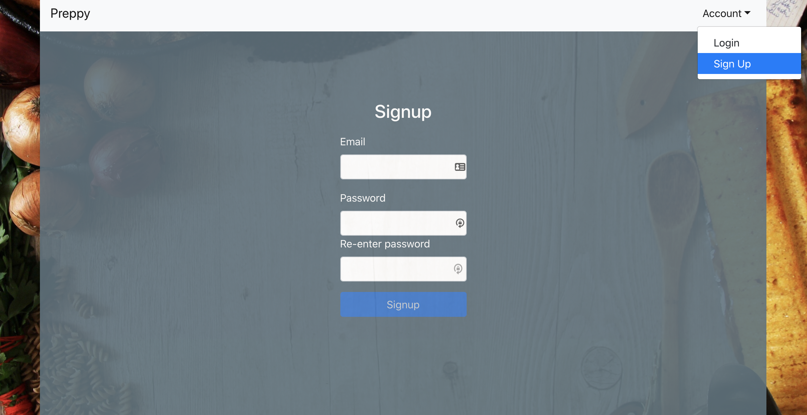
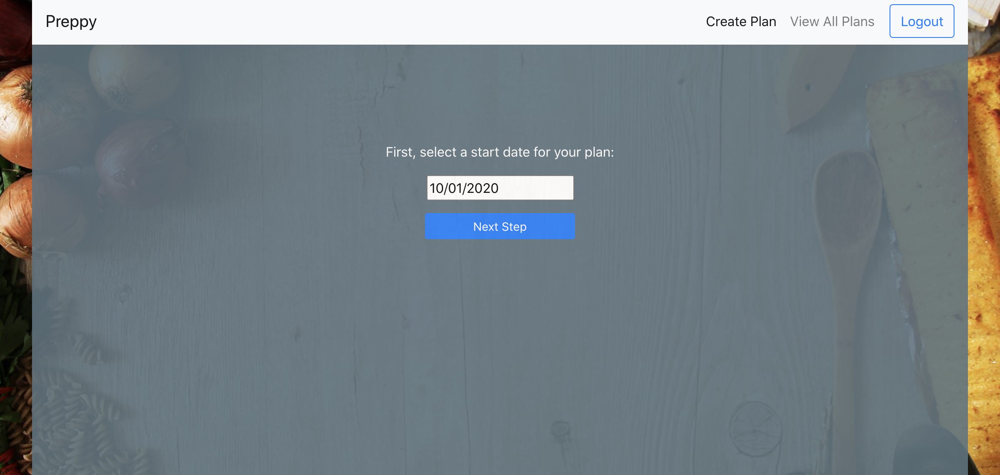
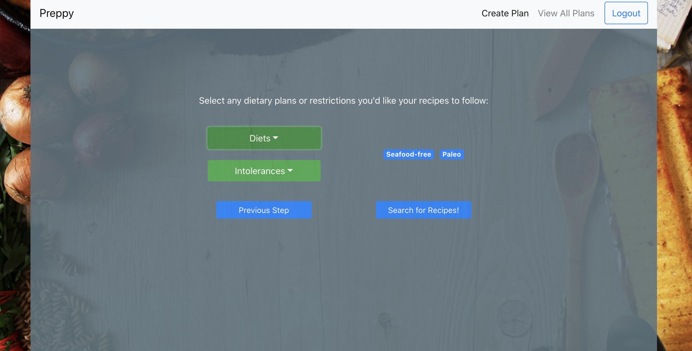
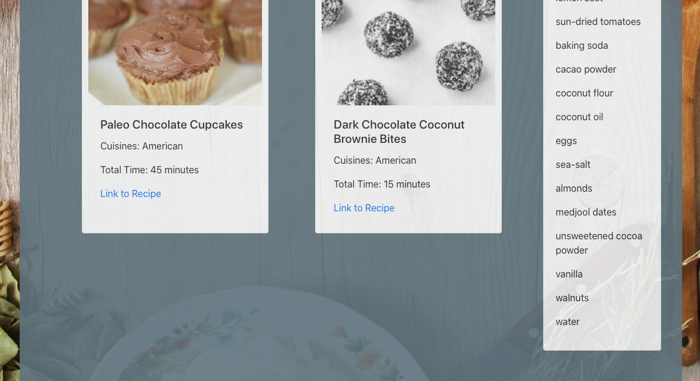

# Meal Prep App (Preppy)

### About

This application allows users to create a weeklong meal plan that fits their schedule and includes recipes tailored to their dietary preferences. 

Users select a start date for their plan and input the timeslots they are available to cook on each day of the plan. Then, they select cuisine and dietary preferences, and choose recipes to add to their plan based on these parameters. After users select their recipes, they are taken to a final plan page that shows them which times to cook certain each recipe, and also provides them with a shopping list and recipe cards for reference.

This is a fullstack redesign of my previous meal prep application, and is built in React.js, with a Node.js backend and PostgreSQL database. The Spoonacular Recipe API is used for dynamic recipe searching.

[Link to deployed app](https://polar-basin-68400.herokuapp.com/)

### Technology Used

* JavaScript
  * React.js
  * Node.js
  * Express.js
  * Axios (API config)
  * Passport.js (authentication)
  * Moment.js (date parsing)
  * FullCalendar.io
* HTML
* CSS
  * React Bootstrap
  * Flexbox
* PostgreSQL
  * Sequelize ORM
* Heroku

### Walkthrough

 

When opening the app, the user will be able to login or create an account (email/password authentication).

#### Login Page

#### Signup Page

#### Account Menu

 

Once the user is authenticated, they will be taken to the main page for the app.

When the user clicks the 'Create Plan' button, they will be taken into a multistep form for creating their meal plan. 

#### Main Page

 

The user first selects their plan start date

#### Plan Start Date

 

Then the user selects the times they are available to cook each day

#### Plan Times

 

The user then selects the cuisine preferences for their plan

#### Plan Cuisines

 

The user then selects their dietary preferences and restrictions

#### Plan Restrictions

#### Recipe Selection

Once all form details are input, the user will be taken to a page where they can select recipes for their plan. They can load more recipes to view by clicking 'View More Recipes', and they can continue with the plan creation process by clicking 'Create Final Plan'.

 

#### Final Plan Page

Once the form is submitted, the user will be taken to the page for their final meal plan. This page includes a calendar view of the week, with time slots of the user's availability, and recipes to cook during each time slot. The user is also able to scroll down and view their recipe cards for the week, along with a shopping list.

 

#### All Plans Page

If the user clicks the 'View All Plans' button at the top of the page, they will be taken to a page where they can view all of their previously created plans. 

 

